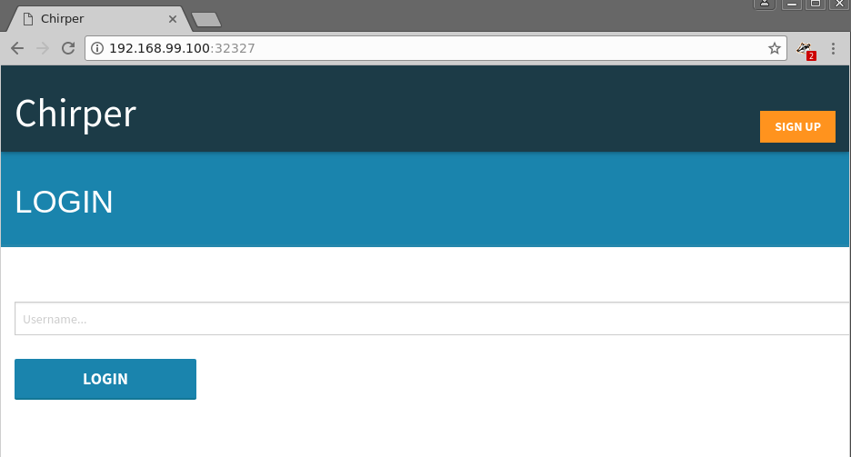
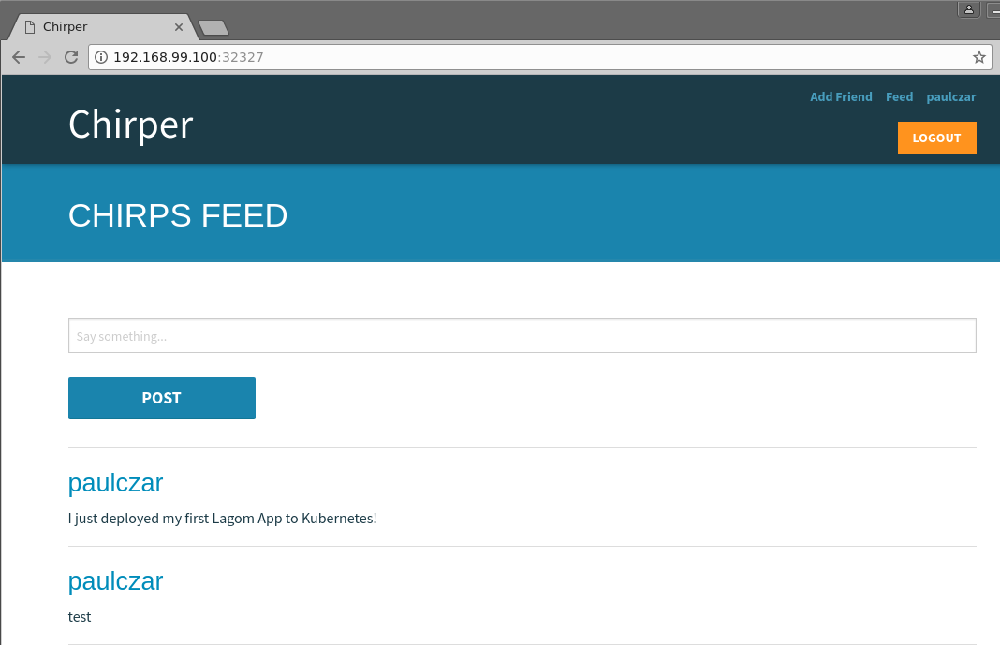

# Deploy Chirper to Bluemix Container Service (Lite)

Lagom is an opinionated microservices framework available to Java and Scala developers that
has been designed to help build, deploy, and run systems with confidence. Lagom
is part of the [Reactive Framework](https://www.lightbend.com/products/reactive-platform)
developed by IBM partner [Lightbend](https://www.lightbend.com) to bring a
modern message driven runtime to Java and Scala.

One would assume that being a microservices framework that it would be a perfect
fit for running in Containers on a modern Kubernetes Infrastructure. That
assumption when tested proves to be correct as you will see in this tutorial.

The goal of this tutorial is to demonstrate that you can take an application
developed within the Lagom framework and deploy it to a modern Container based
Kubernetes Infrastructure.

## Getting Started

To run a Lagom application on Kubernetes we need two things, which should be
pretty obvious, a Lagom app and a Kubernetes. For the app we'll use an example from
the lightbend team called [chirper](https://github.com/IBM/activator-lagom-java-chirper),
For Kubernetes we can use [minikube](https://github.com/kubernetes/minikube) or IBM's
[Bluemix Container Service](https://www.ibm.com/cloud-computing/bluemix/containers)
depending on whether you want to run it locally or not.

Chirper is a twitter like application written in the Lagom framework and utilizes
advanced features like akka clustering, and service discovery. To utilize these correctly
requires the use of a number of Kubernetes resources.  Thankfully the folks that maintain 
this project provide kubernetes manifests to take advantage of these features such as `StatefulSet`,
`Service`, `Ingress`. You can dig into helm charts or kubernetes manifests at `deploy/kubernetes/`
after we clone the Chirper git repo in the next steps.

## Chirper

Install the following on your system:

* [Docker](https://store.docker.com/search?type=edition&offering=community)
* [Helm](https://github.com/kubernetes/helm/blob/master/docs/install.md)
* [OpenJDK 8](http://openjdk.java.net/install/)
* [Maven](https://maven.apache.org/download.cgi#)

Once you have those installed you can clone the Chirper source code locally and check out the stable branch:

 ```bash
$ git clone https://github.com/IBM/activator-lagom-java-chirper chirper
$ cd chirper
$ git checkout stable
 ```

## Deploy Chirper to Bluemix Container Service (Lite)

Bluemix Container Service (BKS) has a free (lite) service that you can use to deploy a Kubernetes cluster
with a single worker node. This is excellent for doing basic testing and development work and can be utilized to deploy Chirper.

### Create Bluemix Container Service (Lite) Cluster

Follow the instructions [here](https://github.com/IBM/container-journey-template/blob/master/README.md)
to create a free single node Kubernetes cluster on Bluemix Container Service (BKS).

Check that nothing else is running on your cluster:

```bash
$ kubectl get pods
No resources found.
```

### Deploy Helm Tiller

Use helm to deploy Tiller to Minikube:

```
$ helm init --upgrade
$HELM_HOME has been configured at /home/pczarkowski/.helm.

Tiller (the Helm server-side component) has been installed into your Kubernetes Cluster.
Happy Helming!
```

Wait a few moments and then check it installed correctly:

```
helm version
Client: &version.Version{SemVer:"v2.6.1", GitCommit:"bbc1f71dc03afc5f00c6ac84b9308f8ecb4f39ac", GitTreeState:"clean"}
Server: &version.Version{SemVer:"v2.6.1", GitCommit:"bbc1f71dc03afc5f00c6ac84b9308f8ecb4f39ac", GitTreeState:"clean"}
```

### Deploy Chirper to Bluemix Container Service (Lite)

Using the provided Helm Charts makes this a fairly trivial task. You can tweak some 
values in `deploy/helm/values.yaml` but simply deploying it should work fine.

Before deploying Chirper we need to tell helm to fetch any dependencies (in this case we
depend on the Cassandra Chart) specified in `deploy/helm/dependencies.yaml`:

```
$ cd deploy/helm
$ helm repo add incubator https://kubernetes-charts-incubator.storage.googleapis.com
$ helm dependency update
```

Now we can use helm to deploy our application:

```
$ helm install -n chirper .
NAME:   chirper
LAST DEPLOYED: Tue Sep 26 10:48:10 2017
NAMESPACE: default
STATUS: DEPLOYED

RESOURCES:
==> v1beta1/Deployment
NAME                      DESIRED  CURRENT  UP-TO-DATE  AVAILABLE  AGE
nginx-default-backend     1        1        1           0          1s
nginx-ingress-controller  1        1        1           0          1s

==> v1beta1/StatefulSet
NAME               DESIRED  CURRENT  AGE
chirper-cassandra  3        1        1s
activityservice    1        1        1s
chirpservice       1        1        1s
friendservice      1        1        1s
web                1        1        1s

==> v1beta1/Ingress
NAME             HOSTS  ADDRESS  PORTS  AGE
chirper-ingress  *      80       1s

==> v1/Service
NAME                           CLUSTER-IP  EXTERNAL-IP  PORT(S)                                       AGE
chirper-cassandra              None        <none>       7000/TCP,7001/TCP,7199/TCP,9042/TCP,9160/TCP  1s
activityservice-akka-remoting  10.0.0.6    <none>       2551/TCP                                      1s
activityservice                None        <none>       9000/TCP                                      1s
chirpservice-akka-remoting     10.0.0.191  <none>       2551/TCP                                      1s
chirpservice                   None        <none>       9000/TCP                                      1s
friendservice-akka-remoting    10.0.0.97   <none>       2551/TCP                                      1s
friendservice                  None        <none>       9000/TCP                                      1s
web                            10.0.0.161  <none>       9000/TCP                                      1s
nginx-ingress                  10.0.0.140  <pending>    80:31635/TCP                                  1s
nginx-default-backend          10.0.0.227  <none>       80/TCP                                        1s
```

You can watch the pods being created by using `kubectl get pods -w` as below.  Once all pods are showing as `Running` you
can hit `CTRL C` to back back to a prompt:

> Note: Cassandra may take a while as it has a fairly complex startup process to handle its clustering etc.

```
$ kubectl get pods -w
NAME                READY     STATUS    RESTARTS   AGE
NAME                                        READY     STATUS    RESTARTS   AGE
activityservice-0                           1/1       Running   0          51s
chirper-cassandra-0                         0/1       Running   0          51s
chirpservice-0                              1/1       Running   0          51s
friendservice-0                             1/1       Running   0          51s
nginx-default-backend-1114943714-prk59      1/1       Running   0          51s
nginx-ingress-controller-2689666257-5bf49   1/1       Running   0          51s
web-0                                       1/1       Running   0          51s
chirper-cassandra-0   1/1       Running   0         2m
chirper-cassandra-1   0/1       Pending   0         0s
chirper-cassandra-1   0/1       Pending   0         0s
chirper-cassandra-1   0/1       ContainerCreating   0         0s
chirper-cassandra-1   0/1       Running   0         1s
^C
$
```

Once deployed you should be able to access Chirper via its web UI, minikube can provide those details for
you like so:

```
$ kubectl get services nginx-ingress
NAME            CLUSTER-IP     EXTERNAL-IP   PORT(S)                      AGE
nginx-ingress   10.10.10.103   <pending>     80:30190/TCP,443:32514/TCP   10m

$ bx cs workers [name-of-cluster]           
ID                    Public IP        Private IP     Machine Type   State    Status   
kube-hou02-xxxxx-w1   169.48.162.22   10.10.10.22   free           normal   Ready   
```

To get the URL of our application we can combine the Public IP from the `bx cs workers` command with the private port of the `nginx-ingress` service. 
The URL for the above results would be http://169.48.162.22:30190 which can be punched into your web browser...



Log in and make some "chirps":




## Cleanup

You can uninstall the chirper app with helm like so:

```
$ helm del chirper --purge
```