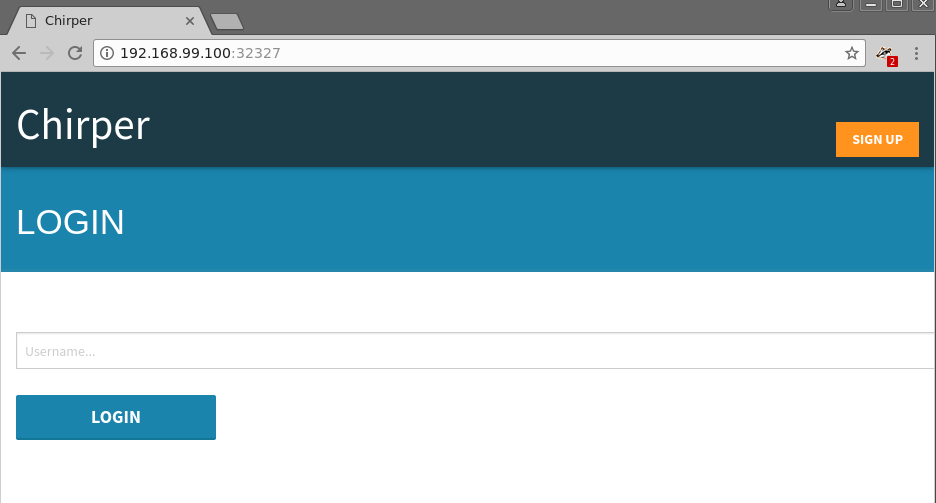

# Deploy Chirper to Bluemix Container Service (Paid)

Lagom is an opinionated microservices framework available to Java and Scala developers that
has been designed to help build, deploy, and run systems with confidence. Lagom
is part of the [Reactive Framework](https://www.lightbend.com/products/reactive-platform)
developed by IBM partner [Lightbend](https://www.lightbend.com) to bring a
modern message driven runtime to Java and Scala.

One would assume that being a microservices framework that it would be a perfect
fit for running in Containers on a modern Kubernetes Infrastructure. That
assumption when tested proves to be correct as you will see in this tutorial.

The goal of this tutorial is to demonstrate that you can take an application
developed within the Lagom framework and deploy it to a modern Container based
Kubernetes Infrastructure.

## Getting Started

To run a Lagom application on Kubernetes we need two things, which should be
pretty obvious, a Lagom app and a Kubernetes. For the app we'll use an example from
the lightbend team called [chirper](https://github.com/IBM/activator-lagom-java-chirper),
For Kubernetes we can use [minikube](https://github.com/kubernetes/minikube) or IBM's
[Bluemix Container Service](https://www.ibm.com/cloud-computing/bluemix/containers)
depending on whether you want to run it locally or not.

Chirper is a twitter like application written in the Lagom framework and utilizes
advanced features like akka clustering, and service discovery. To utilize these correctly
requires the use of a number of Kubernetes resources.  Thankfully the folks that maintain 
this project provide kubernetes manifests to take advantage of these features such as `StatefulSet`,
`Service`, `Ingress`. You can dig into helm charts or kubernetes manifests at `deploy/kubernetes/`
after we clone the Chirper git repo in the next steps.

## Chirper

Install the following on your system:

* [Docker](https://store.docker.com/search?type=edition&offering=community)
* [Helm](https://github.com/kubernetes/helm/blob/master/docs/install.md)
* [OpenJDK 8](http://openjdk.java.net/install/)
* [Maven](https://maven.apache.org/download.cgi#)

Once you have those installed you can clone the Chirper source code locally and check out the stable branch:

 ```bash
$ git clone https://github.com/IBM/activator-lagom-java-chirper chirper
$ cd chirper
$ git checkout stable
 ```

## Deploy Chirper to Bluemix Container Service (Paid)

A paid Bluemix Container Service (BKS) cluster has at least three worker nodes and gives us a lot of flexibility to deploy Chirper in a more production like way with a load balanced HA Chirper deployment.

### Create Bluemix Container Service (Paid) Cluster

Use the [Bluemix UI](https://console.bluemix.net) to create a [Bluemix Container Service](https://console.bluemix.net/docs/containers/container_index.html#container_index) called `chirper`

> Note: You could use the CLI, but you have to do a bunch of detective work to determine what values to use for machine type, location, vlan, etc. For the sake of the demo it is much easier to use the webui.

Once the cluster is created we can switch to the bluemix cli and ensure that its ready:

> Note: For the sake of simplicity this guide specifies the cluster as "chirper", you can name it anything you like, just make sure to adjust any commands provided in the instructions to reflect your cluster name.

```bash
$ bx cs cluster-config chirper
OK
The configuration for chirper was downloaded successfully. Export environment variables to start using Kubernetes.

export KUBECONFIG=/home/xxx/.bluemix/plugins/container-service/clusters/chirper/kube-config-dal10-chirper.yml

$ export KUBECONFIG=/home/xxx/.bluemix/plugins/container-service/clusters/chirper/kube-config-dal10-chirper.yml
$ kubectl get nodes
NAME             STATUS    AGE       VERSION
10.177.184.248   Ready     2d        v1.7.4-1+5471fb38912193
10.177.184.252   Ready     2d        v1.7.4-1+5471fb38912193
10.177.184.253   Ready     2d        v1.7.4-1+5471fb38912193
```

> Note: please ensure that the Kubernetes version on the nodes is at least v1.7.4.  If not, you may need to upgrade the cluster before proceeding.


### Deploy Helm Tiller

Use helm to deploy Tiller to Minikube:

```
$ helm init --upgrade
$HELM_HOME has been configured at /home/pczarkowski/.helm.

Tiller (the Helm server-side component) has been installed into your Kubernetes Cluster.
Happy Helming!
```

Wait a few moments and then check it installed correctly:

```
helm version
Client: &version.Version{SemVer:"v2.6.1", GitCommit:"bbc1f71dc03afc5f00c6ac84b9308f8ecb4f39ac", GitTreeState:"clean"}
Server: &version.Version{SemVer:"v2.6.1", GitCommit:"bbc1f71dc03afc5f00c6ac84b9308f8ecb4f39ac", GitTreeState:"clean"}
```

### Create a Bluemix Container Registry

In production we want to ensure that we own the availabilty and versions of the Images we will run.  To do so we can use the
Bluemix Container Service.

> Note: For the sake of simplicity we used the namespace `chirper`, however the namespace must be unique and therefore you will need to call it something else.  Create a uniquely named namepace and replace our use of `chirper` with that unique name.


```bash
$ bx plugin install container-registry -r Bluemix
$ bx cr namespace-add chirper
Adding namespace 'chirper'...
Successfully added namespace 'chirper'

$ bx cr login                                      
Logging in to 'registry.ng.bluemix.net'...
Logged in to 'registry.ng.bluemix.net'.
OK
```

### Build the Chirper Docker Images

The next step is to build the Chirper containers, to do this we're going to be
a bit cheeky and use the official Maven Docker image to build it for us by mapping in both our docker socket and the chirper source:

```bash
$ mvn clean package docker:build
...
...
[INFO] BUILD SUCCESS
[INFO] ------------------------------------------------------------------------
[INFO] Total time: 03:32 min
[INFO] Finished at: 2017-09-12T15:23:50Z
[INFO] Final Memory: 92M/801M
[INFO] ------------------------------------------------------------------------ 

$ docker images | grep chirper | grep "1\.0"
chirper/front-end                                     1.0-SNAPSHOT        bcdd958e3ab5        55 seconds ago       132MB
chirper/load-test-impl                                1.0-SNAPSHOT        9e46ef8b7443        About a minute ago   143MB
chirper/activity-stream-impl                          1.0-SNAPSHOT        b2610649d20f        About a minute ago   143MB
chirper/chirp-impl                                    1.0-SNAPSHOT        d90d06316151        2 minutes ago        143MB
chirper/friend-impl                                   1.0-SNAPSHOT        f6a9a1b0a900        2 minutes ago        143MB
```

Next push the images to the Bluemix Registry (update the first command to reflect your registry namespace):

```
$ export NAMESPACE=chirper

$ docker tag chirper/front-end:1.0-SNAPSHOT registry.ng.bluemix.net/$NAMESPACE/front-end:1.0-SNAPSHOT && \
  docker tag chirper/activity-stream-impl:1.0-SNAPSHOT registry.ng.bluemix.net/$NAMESPACE/activity-stream-impl:1.0-SNAPSHOT && \
  docker tag chirper/chirp-impl:1.0-SNAPSHOT registry.ng.bluemix.net/$NAMESPACE/chirp-impl:1.0-SNAPSHOT && \
  docker tag chirper/friend-impl:1.0-SNAPSHOT registry.ng.bluemix.net/$NAMESPACE/friend-impl:1.0-SNAPSHOT

$ docker push registry.ng.bluemix.net/$NAMESPACE/front-end:1.0-SNAPSHOT && \
  docker push registry.ng.bluemix.net/$NAMESPACE/activity-stream-impl:1.0-SNAPSHOT && \
  docker push registry.ng.bluemix.net/$NAMESPACE/chirp-impl:1.0-SNAPSHOT && \
  docker push registry.ng.bluemix.net/$NAMESPACE/friend-impl:1.0-SNAPSHOT
  
```

For the sake of simplicity we'll use the community provided images for both nginx and cassandra containers, but in a real production deployment you would likely want to tag and push them to your bluemix registry.

### Update values.yaml for BKS

Update the provided `deploy/helm/examples/bluemix-container-service/values.yaml` to use our images:

Do these for each of our `chirper` services (just one shown as example below):

```yaml
  front_end:
    replicas: 2
    image:
      repo: registry.ng.bluemix.net/chirper/front-end
      tag: 1.0-SNAPSHOT
```

run `bx cs cluster-info` across your cluster to get your Ingress subdomain and Ingress secret:

```bash
$ bx cs cluster-get chirper | grep Ingress
Ingress subdomain:	chirper.us-south.containers.mybluemix.net
Ingress secret:		chirper
```

Update the provided `deploy/helm/examples/bluemix-container-service/values.yaml` with our Ingress subdomain and Ingress secret:

```yaml
chirper:
  ingress:
    host: chirper.us-south.containers.mybluemix.net
    tls:
      secret: chirper
```

### Deploy Chirper

Change into the helm deploy directory and deploy:

```
$ cd deploy/helm
$ helm install -n chirper . --values examples/bluemix-container-service/values.yaml
NAME:   chirper
LAST DEPLOYED: Tue Sep 26 13:42:33 2017
NAMESPACE: default
STATUS: DEPLOYED

RESOURCES:
==> v1/Service
NAME                           CLUSTER-IP    EXTERNAL-IP  PORT(S)                                       AGE
chirper-cassandra              None          <none>       7000/TCP,7001/TCP,7199/TCP,9042/TCP,9160/TCP  2s
activityservice-akka-remoting  10.10.10.184  <none>       2551/TCP                                      2s
activityservice                None          <none>       9000/TCP                                      2s
chirpservice-akka-remoting     10.10.10.244  <none>       2551/TCP                                      2s
chirpservice                   None          <none>       9000/TCP                                      2s
friendservice-akka-remoting    10.10.10.107  <none>       2551/TCP                                      2s
friendservice                  None          <none>       9000/TCP                                      2s
web                            10.10.10.68   <none>       9000/TCP                                      2s
nginx-ingress                  10.10.10.166  <none>       80/TCP                                        2s
nginx-default-backend          10.10.10.7    <none>       80/TCP                                        2s

==> v1beta1/Deployment
NAME                      DESIRED  CURRENT  UP-TO-DATE  AVAILABLE  AGE
nginx-default-backend     2        2        2           0          2s
nginx-ingress-controller  2        2        2           0          2s

==> v1beta1/StatefulSet
NAME               DESIRED  CURRENT  AGE
chirper-cassandra  3        1        2s
activityservice    2        1        2s
chirpservice       2        1        2s
friendservice      2        1        2s
web                1        1        2s

==> v1beta1/Ingress
NAME             HOSTS                                          ADDRESS  PORTS  AGE
chirper-ingress  chirper-new.us-south.containers.mybluemix.net  80, 443  2s

```

You can watch the pods being created by using `kubectl get pods -w` as below.  Once all pods are showing as `Running` you
can hit `CTRL C` to back back to a prompt:

> Note: Cassandra may take a while as it has a fairly complex startup process to handle its clustering etc.

```
$ kubectl get pods -w
NAME                READY     STATUS    RESTARTS   AGE
NAME                                        READY     STATUS    RESTARTS   AGE
activityservice-0                           1/1       Running   0          51s
chirper-cassandra-0                         0/1       Running   0          51s
chirpservice-0                              1/1       Running   0          51s
friendservice-0                             1/1       Running   0          51s
nginx-default-backend-1114943714-prk59      1/1       Running   0          51s
nginx-ingress-controller-2689666257-5bf49   1/1       Running   0          51s
web-0                                       1/1       Running   0          51s
chirper-cassandra-0   1/1       Running   0         2m
chirper-cassandra-1   0/1       Pending   0         0s
chirper-cassandra-1   0/1       Pending   0         0s
chirper-cassandra-1   0/1       ContainerCreating   0         0s
chirper-cassandra-1   0/1       Running   0         1s
^C
$
```


Once deployed you should be able to access Chirper in your browser. Since we're using BKS we get a real URL we can load, as well as TLS offloading!

Simply paste your Ingress URL from above into your browser (either http or https!) and you're good to go!



Log in and make some "chirps":


## Cleanup

You can uninstall the chirper app with helm like so:

```
$ helm del chirper --purge
```
