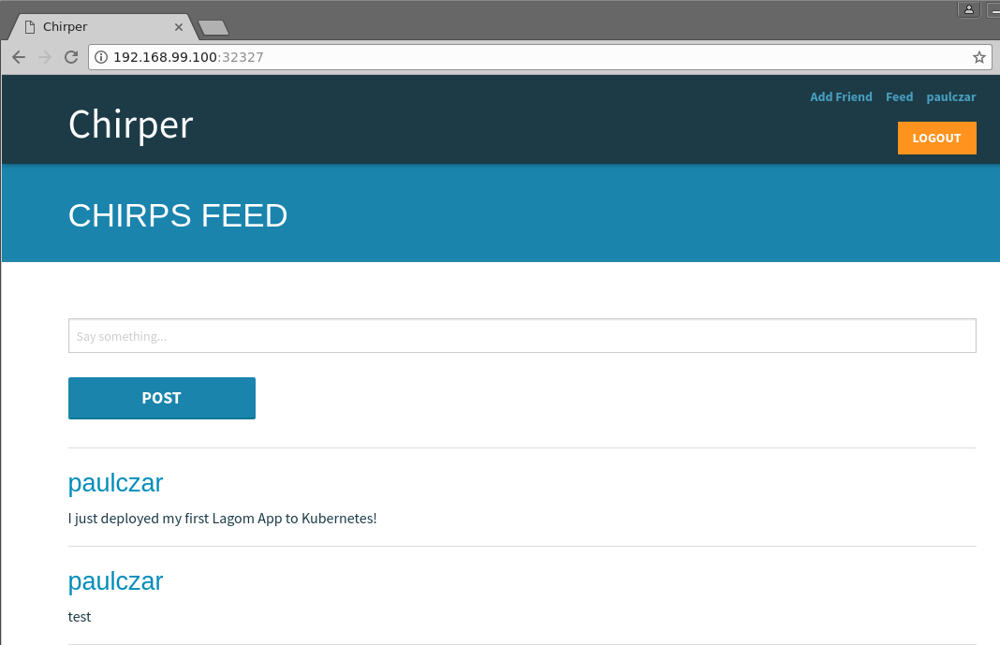

# Deploy Chirper to IBM Cloud Private

Lagom is an opinionated microservices framework available to Java and Scala developers that
has been designed to help build, deploy, and run systems with confidence. Lagom
is part of the [Reactive Framework](https://www.lightbend.com/products/reactive-platform)
developed by IBM partner [Lightbend](https://www.lightbend.com) to bring a
modern message driven runtime to Java and Scala.

One would assume that being a microservices framework that it would be a perfect
fit for running in Containers on a modern Kubernetes Infrastructure. That
assumption when tested proves to be correct as you will see in this tutorial.

The goal of this tutorial is to demonstrate that you can take an application
developed within the Lagom framework and deploy it to a modern Container based
Kubernetes Infrastructure.

## Getting Started

To run a Lagom application on Kubernetes we need two things, which should be
pretty obvious, a Lagom app and a Kubernetes. For the app we'll use an example from
the lightbend team called [chirper](https://github.com/IBM/activator-lagom-java-chirper),
For Kubernetes we can use [minikube](https://github.com/kubernetes/minikube) or IBM's
[Bluemix Container Service](https://www.ibm.com/cloud-computing/bluemix/containers)
depending on whether you want to run it locally or not.

Chirper is a twitter like application written in the Lagom framework and utilizes
advanced features like akka clustering, and service discovery. To utilize these correctly
requires the use of a number of Kubernetes resources.  Thankfully the folks that maintain 
this project provide kubernetes manifests to take advantage of these features such as `StatefulSet`,
`Service`, `Ingress`. You can dig into helm charts or kubernetes manifests at `deploy/kubernetes/`
after we clone the Chirper git repo in the next steps.

### Chirper

Install the following on your system:

* [Docker](https://store.docker.com/search?type=edition&offering=community)
* [Helm](https://github.com/kubernetes/helm/blob/master/docs/install.md)
* [OpenJDK 8](http://openjdk.java.net/install/)
* [Maven](https://maven.apache.org/download.cgi#)

Once you have those installed you can clone the Chirper source code locally and check out the stable branch:

 ```bash
$ git clone https://github.com/IBM/activator-lagom-java-chirper chirper
$ cd chirper
$ git checkout stable
 ```

### IBM Cloud Private

Tools like minikube and services like Bluemix Container Service are fantastic, however you may not want to
run your workloads on your laptop (I HOPE!), and sometimes you need to run your applications in your own
datacenter. IBM Cloud Private (ICP) is a carefully built and curated Kubernetes install that you can run
anywhere.

> Note: If you don't have access to an IBM Cloud Private cluster you can install one by following the instructions [here](https://github.com/IBM/deploy-ibm-cloud-private).

Configure `kubectl` using the instructions provided by your ICP cluster's Web Interface (click Admin in top right hand corner and select "configure client")


```bash
$ kubectl config set-cluster cfc --server=https://169.46.198.xxx:8001 --insecure-skip-tls-verify=true
$ kubectl config set-context cfc --cluster=cfc
$ kubectl config set-credentials user --token=eyJhbGciOiJSUzI1NXXXSSSS
$ kubectl config set-context cfc --user=user --namespace=default
$ kubectl config use-context cfc
```

Check you can interact with your ICP cluster via kubectl:

```bash
$ kubectl get nodes
NAME             STATUS    AGE       VERSION
169.46.198.XXX   Ready     23h       v1.7.3-7+154699da4767fd
169.46.198.XXX   Ready     23h       v1.7.3-7+154699da4767fd
169.46.198.XXX   Ready     23h       v1.7.3-7+154699da4767fd
```

### Deploy Helm Tiller

Use helm to deploy Tiller to Minikube:

```
$ helm init --upgrade
$HELM_HOME has been configured at /home/pczarkowski/.helm.

Tiller (the Helm server-side component) has been installed into your Kubernetes Cluster.
Happy Helming!
```

Wait a few moments and then check it installed correctly:

```
helm version
Client: &version.Version{SemVer:"v2.6.1", GitCommit:"bbc1f71dc03afc5f00c6ac84b9308f8ecb4f39ac", GitTreeState:"clean"}
Server: &version.Version{SemVer:"v2.6.1", GitCommit:"bbc1f71dc03afc5f00c6ac84b9308f8ecb4f39ac", GitTreeState:"clean"}
```


### Create ICP Docker Registry Namespace

Create a new Docker Registry Namespace "chirper" by clicking the menu on the top left corner and choosing System -> Organization -> Namespaces -> New Namespace.


You will need to make sure that you have your local machine set up to communicate safely with your ICP cluster.  

Ensure that you have DNS set up properly for the cluster, if you don't you can fake it by adding the following to your `/etc/hosts` file:

```
IP-ADDRESS-OF-MASTER mycluster.icp
```

You also need to tell your local docker to allow the CA cert that the communication was signed with.  You can find the cert on your master node in `/etc/docker/certs.d/mycluster.icp\:8500/ca.crt` and need to copy that locally to the same path.

You should now be able to login using the user/pass that you use to log into ICP:

```
$  docker login https://mycluster.icp:8500
Username: admin
Password: 
Login Succeeded
```

You also need to create a Kubernetes secret we can use later:

```
$ kubectl create secret docker-registry regsecret --docker-server=mycluster.icp:8500 \
  --docker-username=admin --docker-password=<your-password> --docker-email="none@here.com"
```

### Build Chirper with Maven

Maven supports building Docker images so building the application should be as
simple as running:

```bash
$ mvn clean package docker:build
...
...
[INFO] BUILD SUCCESS
[INFO] ------------------------------------------------------------------------
[INFO] Total time: 03:32 min
[INFO] Finished at: 2017-09-12T15:23:50Z
[INFO] Final Memory: 92M/801M
[INFO] ------------------------------------------------------------------------ 

$ docker images | grep chirper | grep "1\.0"
chirper/front-end                                     1.0-SNAPSHOT        bcdd958e3ab5        55 seconds ago       132MB
chirper/load-test-impl                                1.0-SNAPSHOT        9e46ef8b7443        About a minute ago   143MB
chirper/activity-stream-impl                          1.0-SNAPSHOT        b2610649d20f        About a minute ago   143MB
chirper/chirp-impl                                    1.0-SNAPSHOT        d90d06316151        2 minutes ago        143MB
chirper/friend-impl                                   1.0-SNAPSHOT        f6a9a1b0a900        2 minutes ago        143MB
```

Next push the images to the ICP registry:

```
$ docker tag chirper/front-end:1.0-SNAPSHOT mycluster.icp:8500/chirper/front-end:1.0-SNAPSHOT && \
  docker tag chirper/activity-stream-impl:1.0-SNAPSHOT mycluster.icp:8500/chirper/activity-stream-impl:1.0-SNAPSHOT && \
  docker tag chirper/chirp-impl:1.0-SNAPSHOT mycluster.icp:8500/chirper/chirp-impl:1.0-SNAPSHOT && \
  docker tag chirper/friend-impl:1.0-SNAPSHOT mycluster.icp:8500/chirper/friend-impl:1.0-SNAPSHOT

$ docker push mycluster.icp:8500/chirper/front-end:1.0-SNAPSHOT && \
  docker push mycluster.icp:8500/chirper/activity-stream-impl:1.0-SNAPSHOT && \
  docker push mycluster.icp:8500/chirper/chirp-impl:1.0-SNAPSHOT && \
  docker push mycluster.icp:8500/chirper/friend-impl:1.0-SNAPSHOT
```

### Deploy Chirper to IBM Cloud Private

Using the provided Helm Charts makes this a fairly trivial task. You can tweak some 
values in `deploy/helm/values.yaml` but simply deploying it should work fine.

Before deploying Chirper we need to tell helm to fetch any dependencies (in this case we
depend on the Cassandra Chart) specified in `deploy/helm/dependencies.yaml`:

```
$ cd deploy/helm
$ helm repo add incubator https://kubernetes-charts-incubator.storage.googleapis.com
$ helm dependency update
```

You can now deploy Chirper using helm:

```
$ helm install -n chirper . --values examples/ibm-cloud-private/values.yaml
NAME:   chirper
LAST DEPLOYED: Tue Sep 26 17:05:37 2017
NAMESPACE: default
STATUS: DEPLOYED

RESOURCES:
==> v1beta1/Ingress
NAME             HOSTS  ADDRESS         PORTS  AGE
chirper-ingress  *      169.46.198.XXX  80     3s

==> v1/Service
NAME                           CLUSTER-IP     EXTERNAL-IP  PORT(S)                                       AGE
chirper-cassandra              None           <none>       7000/TCP,7001/TCP,7199/TCP,9042/TCP,9160/TCP  4s
activityservice-akka-remoting  192.168.0.213  <none>       2551/TCP                                      4s
activityservice                None           <none>       9000/TCP                                      4s
chirpservice-akka-remoting     192.168.0.211  <none>       2551/TCP                                      4s
chirpservice                   None           <none>       9000/TCP                                      4s
friendservice-akka-remoting    192.168.0.35   <none>       2551/TCP                                      4s
friendservice                  None           <none>       9000/TCP                                      4s
web                            192.168.0.144  <none>       9000/TCP                                      4s
nginx-ingress                  192.168.0.69   <pending>    80:30763/TCP                                  4s
nginx-default-backend          192.168.0.80   <none>       80/TCP                                        4s

==> v1beta1/Deployment
NAME                      DESIRED  CURRENT  UP-TO-DATE  AVAILABLE  AGE
nginx-default-backend     2        2        2           0          4s
nginx-ingress-controller  2        2        2           0          4s

==> v1beta1/StatefulSet
NAME               DESIRED  CURRENT  AGE
chirper-cassandra  3        1        4s
activityservice    2        1        4s
chirpservice       2        1        4s
friendservice      2        1        3s
web                1        1        3s

```

You can watch the pods being created by using `kubectl get pods -w` as below.  Once all pods are showing as `Running` you
can hit `CTRL C` to back back to a prompt:

> Note: Cassandra may take a while as it has a fairly complex startup process to handle its clustering etc.

```
$ kubectl get pods -w
NAME                READY     STATUS    RESTARTS   AGE
NAME                                        READY     STATUS    RESTARTS   AGE
activityservice-0                           1/1       Running   0          51s
chirper-cassandra-0                         0/1       Running   0          51s
chirpservice-0                              1/1       Running   0          51s
friendservice-0                             1/1       Running   0          51s
nginx-default-backend-1114943714-prk59      1/1       Running   0          51s
nginx-ingress-controller-2689666257-5bf49   1/1       Running   0          51s
web-0                                       1/1       Running   0          51s
chirper-cassandra-0   1/1       Running   0         2m
chirper-cassandra-1   0/1       Pending   0         0s
chirper-cassandra-1   0/1       Pending   0         0s
chirper-cassandra-1   0/1       ContainerCreating   0         0s
chirper-cassandra-1   0/1       Running   0         1s
^C
$
```


Once deployed you should be able to access Chirper via its web UI. It should be made available by your ICP proxy nodes via http://mycluster.icp


Copy and paste the URL http://mycluster.icp into your browser...


Log in and make some "chirps":



## Clean up

You can uninstall the chirper app with helm like so:

```
$ helm del chirper --purge
```
